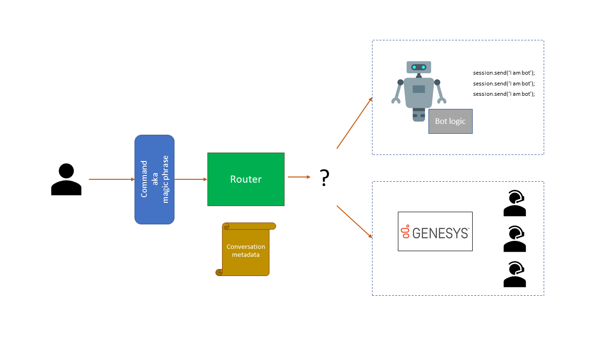

<a name="HOLTitle"></a>
# Bot Handoff - A NodeJS Genesys Example #

Software bots are everywhere. You probably interact with them every day without realizing it. Bots, especially chat and messenger bots, are changing the way we interact with businesses, communities, and even each other. Thanks to light-speed advances in artificial intelligence (AI) and the ready availability of AI services, bots are not only becoming more advanced and personalized, but also more accessible to developers. 

In this example, we will talk about a common scenario where we need to pass the interaction to a real human or call center support. In scenarios where the bot is confused or having errors multiple times, we can use this method to ease user frustration(Sometimes I think human give me more headache). 

<a name="when"></a>
## When to trigger the hand over? ##

We have several options to use as a trigger. We can
1.	Use LUIS to detect key phrase.</br>
When a user says ‘help’, ‘support’ 

2.	Use LUIS to detect sentiment.</br>
When a user use these expression ‘I need to talk to a human’, ‘Are you stupid?’, ‘Are you ~!@#$%^ stupid?’

3.	Use Prompts to give user a button to tap.</br>
When the bot initiates, show a couple of buttons to the user to tap and talk to a person.

Which options to use? It really depends on how you implement your bot. All 3 options are a good approach depending on bot design.

<a name="architecture"></a>
## The Architecture ##

I highly recommend to watch the overview concept of bot handoff by Hannah Krager presented at /BUILD// [here](https://www.youtube.com/watch?v=u38QSqo2_H4).



The concept of handover is quite straight forward. We have commands aka magic words or phrases to trigger the handover dialog. We can use triggerAction as shown below:-

```javascript
bot.dialog('/Support', require('./support'))
    .triggerAction({
        matches: [/help/i, /support/i,]
    });
```
Note: There are also other scenario where you may want to bind action after trigger – [refer here](https://docs.microsoft.com/en-us/azure/bot-service/nodejs/bot-builder-nodejs-dialog-actions?view=azure-bot-service-3.0)

When the bot detects the magic word, it will invoke the router which role is to route message correctly to either bot or a call center, in our case Genesys. The router acts as a middleware to pass message between bot and agent presented to the user. If there is incoming message from Agent, tag the message as coming from agent. 

```javascript
session.userData.chatID = Body.chatId;
session.userData.agentUserID = Body.userId;
session.userData.agentAlias = Body.alias;
session.userData.secureKey = Body.secureKey;
session.userData.agentConnected = true;

session.send( {type: 'message',
               text: Body.messages[i].text,
               user: 'Agent'}) 
```

This is the same as user. If the message is send through the client, it will be tag as user. The routing will also include conversation metadata. Things like user address, agent address and the message transcript. Bot in the architecture contains all your bot code, logic, dialog flows etc. Once the handover is successfully initiated, we can pass everything to Genesys.


Genesys GMS servers chat flow as follow:-


Upon triggering the chatAPI to the Genesys GMS server, Genesys ORS(Orchestration Server) will handle all the incoming message and put it into a queue. URS will then route the request to available agents. The Agents accepting the handover will then trigger a welcome message or send a message which will be pass trough ORS to GMS and eventually show up to the user. If you wish to learn more on how Genesys backend work, refer the Reference section.

<a name="approach"></a>
## The Approach ##

Assumption:
1.	You already have Genesys GMS servers setup and properly configured to expose chatAPI
2.	Your Genesys GMS server url is http://myownGMSurl and your service name is customer-support

Using the Genesys ChatAPI</br>
https://docs.genesys.com/Documentation/GMS/latest/API/ChatAPIv2 

The Genesys documentation is quite comprehensive. It has example of API calls with parameter and return values that our bot can digest and present back to the user. The following is the overview of how this can be done.

**1\. Initiate chat with Genesys servers.</br>**
You need to specify your server name and service name as follow /genesys/2/chat/{serviceName} when making a post request to Genesys server.

```javascript
gmsURL='http://myownGMSurl:8080/genesys/2/chat/customer-support/'
        , param="nickname=test000"
        , Option={
        "headers": { "content-type": "application/x-www-form-urlencoded" },
        "url": gmsURL,
        "body": param
        }
```
*Take note on the parameter. Mandatory nickname or combination of first and last name. If you provide a different content type, you may not get a 200 response from your Genesys server as well.

```javascript
var Body = JSON.parse(body);
if (response.statusCode==200){    
                session.userData.chatID =Body.chatId;
                session.userData.agentUserID = Body.userId;
                session.userData.agentAlias = Body.alias;
                session.userData.secureKey = Body.secureKey;
                session.userData.agentConnected = true; }
```
The next step is to parse the body to retrieve chatID and secureKey. Without these, we cannot send message to the Genesys server. The agentUserID, agentAlias and connection status is important as well. This allow us to control when the bot should stop talking to the agent etc.

**2\.	Poll the Genesys server for changes.</br>**
By design, Genesys requires a user to poll the server in a time interval. Genesys recommends 3-5 seconds interval.

```javascript
setInterval(function() {
                 gmsURL_r    = 'http://myownGMSurl:8080/genesys/2/chat/customer-support/'+session.userData.chatID+'/refresh'
                    ,param_r    ={  secureKey : session.userData.secureKey,
                                    userId : session.userData.agentUserID,
                                    alias :  session.userData.agentAlias,
                                    userData : {vAuthenticated:false, isOnline:true}}
                    , Option_r  ={  "headers": { "content-type": "application/x-www-form-urlencoded" },
                                    "url": gmsURL_r,
                                    "form" : param_r}
                    console.log("We are now polling in milliseconds");
                    }
                    , 3000)
```
The polling acts like a heartbeat to query the Genesys server if there is any event changes. 

```javascript
request.post(Option_r, (error, response, body) => {
                        if(error) {
                            return console.dir(error);
                            session.send('Error Requesting chat');
                        }
                        if (response.statusCode==200) {
                            Body=JSON.parse(body);
                            var i=Body.messages.length-1;
                            if(Body.messages[i].from.type=="Agent" && Body.messages[i].type=="Message" && Body.nextPosition-1==Body.messages[i].index){
                            session.send( {type: 'message',
                                text: Body.messages[i].text,
                                user: 'Agent'})                 
                            }
                        }
                    })
```

Upon successful poll, you want to read the message passed from the Genesys server. This refresh chat function requests a transcript of events from the specified chat. The value of the transcriptPosition parameter determines which events are returned: 
- If transcriptPosition is set to 0, none of the events from the chat are returned. 0 (no messages)
- If transcriptPosition is set to 1, all of the events from the chat are returned. 1 (all messages)
- If transcriptPosition is set to 2, everything after second events from the chat are returned. 2 (all messages starting from 2nd message) 

Here we use array to traverse the transcript position to return the correct text string sent by the agent. We also specify the message comes from an agent instead of the bot itself.

**3\.	Send message to a human agent**

```javascript
gmsURL_s    =' http://myownGMSurl:8080/genesys/2/chat/customer-support/'+session.userData.chatID+'/send'
        ,param_s    ={  secureKey : session.userData.secureKey,
                        userId : session.userData.agentUserID,
                        alias :  session.userData.agentAlias,
                        userData : {vAuthenticated:false, isOnline:true},
                        message : session.message.text}
        , Option_s  ={  "headers": { "content-type": "application/x-www-form-urlencoded" },
                        "url": gmsURL_s,
                        "form" : param_s}
//Send message
request.post(Option_s,(error, response, body) => {
            if(error) {
                session.send('Error Sending chat message');
            }
            if (response.statusCode==200) {
                console.log('Message sent');
            }
        });
```
To send a message to human agent, we need to supply the correct parameters. [Refer here](https://docs.genesys.com/Documentation/GMS/latest/API/ChatAPIv2#Send_Message) for optional & mandatory parameters. 

## Improvements ##
- Further integration with Genesys API (User/Agent IsTyping)
- C# version
- Logs for agent to see before talking to customer
- Sentiment analysis of chat

## References ##
Bot handoff by Hannah Krager - ```Typescript``` - https://github.com/palindromed/Bot-HandOff</br>
Intermediator bot ```C#``` - https://github.com/tompaana/intermediator-bot-sample</br>
Genesys ORS - https://docs.genesys.com/Documentation/OS</br>
Genesys Chat API documentation - https://docs.genesys.com/Documentation/GMS/latest/API/ChatAPIv2


<a name="Summary"></a>
## Summary ##

There is now more bots than ever! Thanks to all the developers out there creating smart bots for people to consume services by providing a new way of interaction. There is so much more that you can do. You may want to check out also [Dialogs](http://aihelpwebsite.com/Blog/EntryId/9/Introduction-To-Using-Dialogs-With-The-Microsoft-Bot-Framework), [FormFlow](https://blogs.msdn.microsoft.com/uk_faculty_connection/2016/07/14/building-a-microsoft-bot-using-microsoft-bot-framework-using-formflow/), and [Microsoft Language Understanding and Intelligence Services (LUIS)](https://docs.botframework.com/en-us/node/builder/guides/understanding-natural-language/). With these and other features, you can build sophisticated bots that respond to users' queries and commands and interact in a fluid, conversational, and non-linear manner. For more information, and for ideas to get you started, see [What is Microsoft Bot Framework Overview](https://blogs.msdn.microsoft.com/uk_faculty_connection/2016/04/05/what-is-microsoft-bot-framework-overview/).

----
